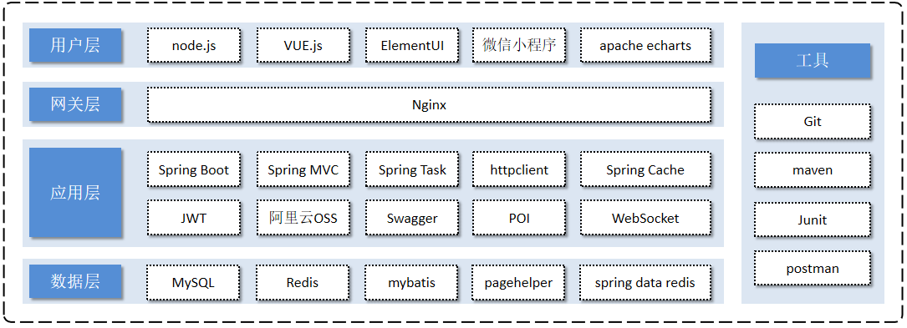
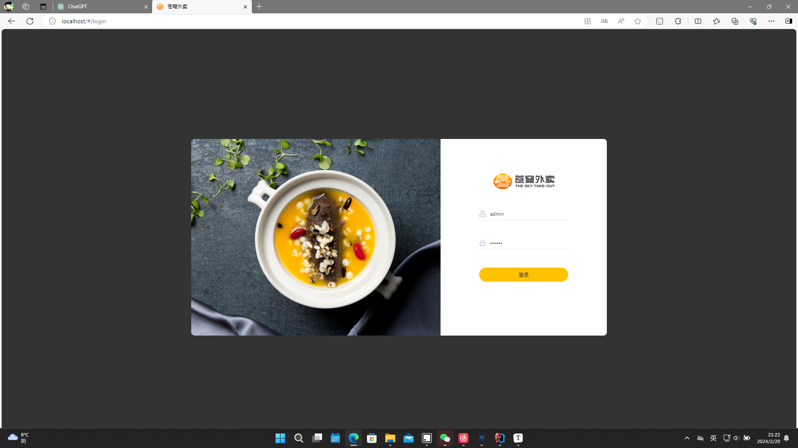
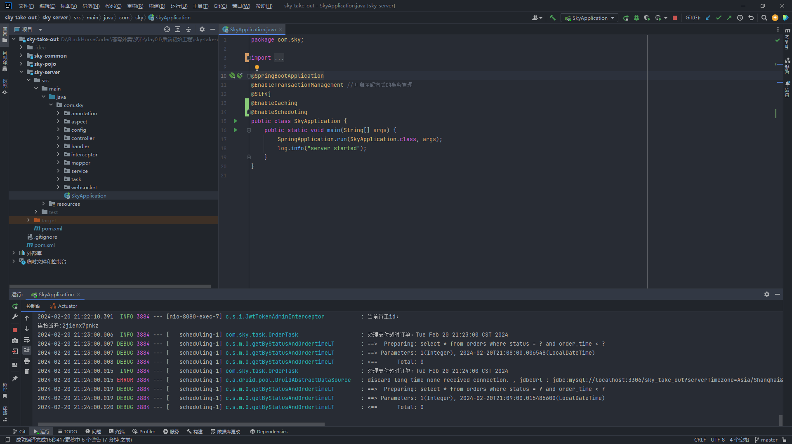
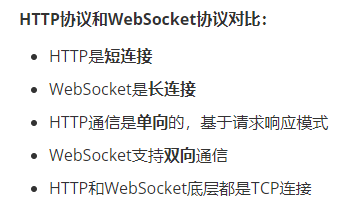
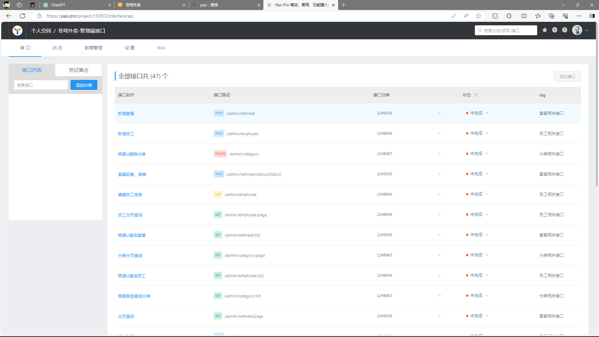
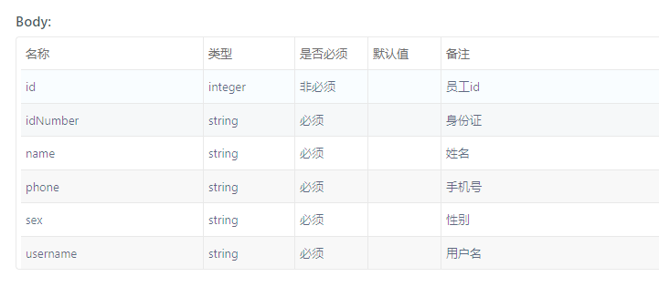
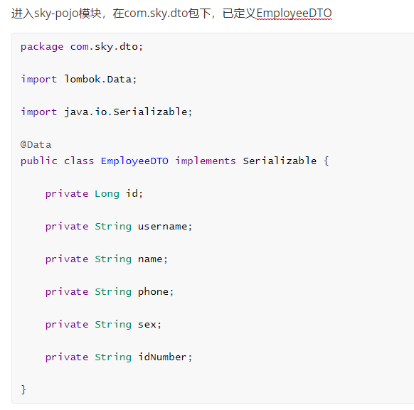
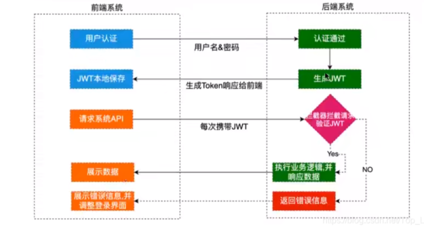

## 项目介绍
MyRestaurant是专门为餐饮企业（餐厅、饭店）定制的一款软件产品，包括 系统管理后台 和 小程序端应用 两部分。其中系统管理后台主要提供给餐饮企业内部员工使用，可以对餐厅的分类、菜品、套餐、订单、员工等进行管理维护，对餐厅的各类数据进行统计。小程序端主要提供给消费者使用，可以在线浏览菜品、添加购物车、下单、支付、催单等。

主要使用的技术栈有SpringBoot，Mybatis，MySQL和Redis等，其中SpringBoot用来快速构建Spring项目，Mybatis用来在mapper层进行数据持久化，底层数据库采用MySQL。还是用了Redis缓存餐品数据。

### 技术选型



#### 网关层
Nginx是一个服务器，主要用来作为Http服务器，部署静态资源，访问性能高。在Nginx中还有两个比较重要的作用： 反向代理和负载均衡， 在进行项目部署时，要实现Tomcat的负载均衡，就可以通过Nginx来实现。

#### 应用层

SpringBoot： 快速构建Spring项目, 采用 "约定优于配置" 的思想, 简化Spring项目的配置开发。

SpringMVC：SpringMVC是spring框架的一个模块，springmvc和spring无需通过中间整合层进行整合，可以无缝集成。

Spring Task:  由Spring提供的定时任务框架。

httpclient:  主要实现了对http请求的发送。

Spring Cache:  由Spring提供的数据缓存框架

JWT:  用于对应用程序上的用户进行身份验证的标记。

阿里云OSS:  对象存储服务，在项目中主要存储文件，如图片等。

Swagger： 可以自动的帮助开发人员生成接口文档，并对接口进行测试。

POI:  封装了对Excel表格的常用操作。

WebSocket: 一种通信网络协议，使客户端和服务器之间的数据交换更加简单，用于项目的来单、催单功能实现。

#### 数据层

MySQL： 关系型数据库, 本项目的核心业务数据都会采用MySQL进行存储。

Redis： 基于key-value格式存储的内存数据库, 访问速度快, 经常使用它做缓存。

Mybatis： 本项目持久层将会使用Mybatis开发。

pagehelper:  分页插件。

spring data redis:  简化java代码操作Redis的API。

#### 工具

git: 版本控制工具, 在团队协作中, 使用该工具对项目中的代码进行管理。

maven: 项目构建工具。

junit：单元测试工具，开发人员功能实现完毕后，需要通过junit对功能进行单元测试。

postman:  接口测工具，模拟用户发起的各类HTTP请求，获取对应的响应结果。


## 启动流程

#### 启动Ngnix

资料->day01->前端运行环境->ngnix

浏览器输入登陆端口：http://localhost:80



#### 启动IDEA

sky-take-out -> sky-server -> SkyApplication



## Q&A

####  1.什么是Ngnix反向代理,为什么使用Ngnix反向代理?

**nginx 反向代理**，就是将前端发送的动态请求由 nginx 转发到后端服务器

- 提高访问速度

  因为nginx本身可以进行缓存，如果访问的同一接口，并且做了数据缓存，nginx就直接可把数据返回，不需要真正地访问服务端，从而提高访问速度。

- 进行负载均衡

  所谓负载均衡,就是把大量的请求按照我们指定的方式均衡的分配给集群中的每台服务器。

- 保证后端服务安全

  因为一般后台服务地址不会暴露，所以使用浏览器不能直接访问，可以把nginx作为请求访问的入口，请求到达nginx后转发到具体的服务中，从而保证后端服务的安全。

**具体使用**：

1.负载均衡配置后端服务器组

```nginx
	upstream webservers{
	  server 127.0.0.1:8080 weight=90 ;
	  #server 127.0.0.1:8088 weight=10 ;
	}
```

2.反向代理

前端监听localhost的80端口，若前端浏览器访问http://localhost:80/.., 则自动根据后缀跳转（使用http）

```nginx
    server {
        listen       80;
        server_name  localhost;

        #charset koi8-r;

        #access_log  logs/host.access.log  main;

        location / {
            root   html/sky;
            index  index.html index.htm;
        }

        #error_page  404              /404.html;

        # redirect server error pages to the static page /50x.html
        #
        error_page   500 502 503 504  /50x.html;
        location = /50x.html {
            root   html;
        }

        # 反向代理,处理管理端发送的请求
        location /api/ {
			proxy_pass   http://localhost:8080/admin/;
            #proxy_pass   http://webservers/admin/;
        }
		
		# 反向代理,处理用户端发送的请求
        location /user/ {
            proxy_pass   http://webservers/user/;
        }
```




#### 2.怎么进行的前后端分离开发?

将管理端的接口json文档导入YApi平台



#### 3.怎么进行的业务开发?

以新增员工为例:

**打开YApi查看接口路径**


**查看请求参数,设计DTO类**





**在Controller中创建新增员工方法,同时编写Service,Mapper层代码**


#### 4.说说Controller,Service和Mapper

Controller负责处理HTTP请求，Service负责执行业务逻辑，而Mapper负责执行数据持久化操作

**Controller(控制器)**

在Spring Boot中，控制器通常由`@Controller`或`@RestController`注解标记，它们处理HTTP请求，并将请求分派到适当的服务层（Service）来执行业务逻辑.控制器通常包含一系列请求处理方法（handler methods），这些方法使用`@RequestMapping`或其他类似注解来映射URL和HTTP请求类型到方法上。在处理请求时，控制器通常会调用服务层的方法来执行业务逻辑，并将结果返回给客户端。

**Service(服务)**

服务层通常由`@Service`注解标记，以便Spring能够自动识别并注入到控制器或其他服务中。服务层可以包含多个方法，每个方法执行特定的业务逻辑。在典型的应用程序中，服务层可以调用持久层（Mapper）来访问数据库或执行其他数据持久化操作。

**Mapper（映射器）**

Mapper负责将Java对象映射到数据库表中的记录，并执行数据库查询、插入、更新和删除等操作。在MyBatis中，Mapper通常是一个接口，包含一组与数据库交互的方法，每个方法对应一个SQL查询或更新操作。

#### 5.使用JWT令牌进行用户身份校验



**认证流程**

- 前端通过Web表单将自己的用户名和密码发送到后端的接口。该过程一般是HTTP的POST请求。建议的方式是通过SSL加密的传输(https协议)，从而避免敏感信息被嗅探。
- 后端核对用户名和密码成功后，将用户的id等其他信息作为JWT Payload(负载)，将其与头部分别进行Base64编码拼接后签名，形成一个JWT(Token)。
- 后端将JWT字符串作为登录成功的返回结果返回给前端。前端可以将返回的结果保存在localStorage（浏览器本地缓存）或sessionStorage（session缓存）上，退出登录时前端删除保存的JWT即可。
- 前端在每次请求时将JWT放入HTTP的Header中的Authorization位。(解决XSS和XSRF问题）HEADER
  后端检查是否存在，如存在验证JWT的有效性。例如，检查签名是否正确﹔检查Token是否过期;检查Token的接收方是否是自己(可选）
- 验证通过后后端使用JWT中包含的用户信息进行其他逻辑操作，返回相应结果。
  

**程序中拦截器的应用**

1.自定义Jwt拦截器

```java
@Component
@Slf4j
public class JwtTokenAdminInterceptor implements HandlerInterceptor {

    @Autowired
    private JwtProperties jwtProperties;

    /**
     * 校验jwt
     *
     * @param request
     * @param response
     * @param handler
     * @return
     * @throws Exception
     */
    public boolean preHandle(HttpServletRequest request, HttpServletResponse response, Object handler) throws Exception {
        //判断当前拦截到的是Controller的方法还是其他资源
        if (!(handler instanceof HandlerMethod)) {
            //当前拦截到的不是动态方法，直接放行
            return true;
        }

        //1、从请求头中获取令牌
        String token = request.getHeader(jwtProperties.getAdminTokenName());

        //2、校验令牌
        try {
            log.info("jwt校验:{}", token);
            Claims claims = JwtUtil.parseJWT(jwtProperties.getAdminSecretKey(), token);
            Long empId = Long.valueOf(claims.get(JwtClaimsConstant.EMP_ID).toString());
            log.info("当前员工id：", empId);
            BaseContext.setCurrentId(empId);
            //3、通过，放行
            return true;
        } catch (Exception ex) {
            //4、不通过，响应401状态码
            response.setStatus(401);
            return false;
        }
    }
}
```

2.在WebMvcConfiguration中注册拦截器

```java
@Configuration
@Slf4j
public class WebMvcConfiguration extends WebMvcConfigurationSupport {

    @Autowired
    private JwtTokenAdminInterceptor jwtTokenAdminInterceptor;
    @Autowired
    private JwtTokenUserInterceptor jwtTokenUserInterceptor;
    /**
     * 注册自定义拦截器
     *
     * @param registry
     */
    protected void addInterceptors(InterceptorRegistry registry) {
        log.info("开始注册自定义拦截器...");
        registry.addInterceptor(jwtTokenAdminInterceptor)
                .addPathPatterns("/admin/**")
                .excludePathPatterns("/admin/employee/login");
        registry.addInterceptor(jwtTokenUserInterceptor)
                .addPathPatterns("/user/**")
                .excludePathPatterns("/user/user/login")
                .excludePathPatterns("/user/shop/status");
    }

```

#### 6.怎么使用的Redis？

使用**Spring Data Redis**：集成在Spring中，对Redis底层开发进行了高度封装

**步骤一：导入Spring Data Redis的Maven坐标**

```xml
<dependency>
     <groupId>org.springframework.boot</groupId>
     <artifactId>spring-boot-starter-data-redis</artifactId>
</dependency>
```

**步骤二：配置Redis数据源**

在application-dev.yml中添加

```yaml
sky:
  redis:
    host: localhost
    port: 6379
    password: 123456
    database: 10
```

在application.yml中添加

```yaml
spring:
  profiles:
    active: dev
  redis:
    host: ${sky.redis.host}
    port: ${sky.redis.port}
    password: ${sky.redis.password}
    database: ${sky.redis.database}
```

**步骤三：通过RedisTemplate对象操作Redis**

编写配置类，创建RedisTemplate对象

```java
package com.sky.config;

import lombok.extern.slf4j.Slf4j;
import org.springframework.context.annotation.Bean;
import org.springframework.context.annotation.Configuration;
import org.springframework.data.redis.connection.RedisConnectionFactory;
import org.springframework.data.redis.core.RedisTemplate;
import org.springframework.data.redis.serializer.StringRedisSerializer;

@Configuration
@Slf4j
public class RedisConfiguration {

    @Bean
    public RedisTemplate redisTemplate(RedisConnectionFactory redisConnectionFactory){
        log.info("开始创建redis模板对象...");
        RedisTemplate redisTemplate = new RedisTemplate();
        //设置redis的连接工厂对象
        redisTemplate.setConnectionFactory(redisConnectionFactory);
        //设置redis key的序列化器
        redisTemplate.setKeySerializer(new StringRedisSerializer());
        return redisTemplate;
    }
}
```

```java
package com.sky.test;

import org.junit.jupiter.api.Test;
import org.springframework.beans.factory.annotation.Autowired;
import org.springframework.boot.test.context.SpringBootTest;
import org.springframework.data.redis.core.*;

@SpringBootTest
public class SpringDataRedisTest {
    @Autowired
    private RedisTemplate redisTemplate;

    @Test
    public void testRedisTemplate(){
        System.out.println(redisTemplate);
        //string数据操作
        ValueOperations valueOperations = redisTemplate.opsForValue();
        //hash类型的数据操作
        HashOperations hashOperations = redisTemplate.opsForHash();
        //list类型的数据操作
        ListOperations listOperations = redisTemplate.opsForList();
        //set类型数据操作
        SetOperations setOperations = redisTemplate.opsForSet();
        //zset类型数据操作
        ZSetOperations zSetOperations = redisTemplate.opsForZSet();
    }
}
```

**使用Redis快速设置和获取店铺营业状态**

设置营业状态：

```java
@RestController("adminShopController")
@RequestMapping("/admin/shop")
@Api(tags = "店铺相关接口")
@Slf4j
public class ShopController {

    public static final String KEY = "SHOP_STATUS";

    @Autowired
    private RedisTemplate redisTemplate;

    /**
     * 设置店铺的营业状态
     * @param status
     * @return
     */
    @PutMapping("/{status}")
    @ApiOperation("设置店铺的营业状态")
    public Result setStatus(@PathVariable Integer status){
        log.info("设置店铺的营业状态为：{}",status == 1 ? "营业中" : "打烊中");
        redisTemplate.opsForValue().set(KEY,status);
        return Result.success();
    }
}
```

查询营业状态：

```java
	/**
     * 获取店铺的营业状态
     * @return
     */
    @GetMapping("/status")
    @ApiOperation("获取店铺的营业状态")
    public Result<Integer> getStatus(){
        Integer status = (Integer) redisTemplate.opsForValue().get(KEY);
        log.info("获取到店铺的营业状态为：{}",status == 1 ? "营业中" : "打烊中");
        return Result.success(status);
    }
```

**使用redis缓存菜品**

**清除缓存方法：**

```java
	@Autowired
    private RedisTemplate redisTemplate;
	/**
     * 清理缓存数据
     * @param pattern
     */
    private void cleanCache(String pattern){
        Set keys = redisTemplate.keys(pattern);
        redisTemplate.delete(keys);
    }
```

在新增菜品，删除菜品，修改菜品时会先删数据库，后删除redis缓存，**来保证数据一致性**

**查询菜品中会将菜品添入Redis缓存**

```java
		@Autowired
    private RedisTemplate redisTemplate;
	/**
     * 根据分类id查询菜品
     *
     * @param categoryId
     * @return
     */
    @GetMapping("/list")
    @ApiOperation("根据分类id查询菜品")
    public Result<List<DishVO>> list(Long categoryId) {

        //构造redis中的key，规则：dish_分类id
        String key = "dish_" + categoryId;

        //查询redis中是否存在菜品数据
        List<DishVO> list = (List<DishVO>) redisTemplate.opsForValue().get(key);
        if(list != null && list.size() > 0){
            //如果存在，直接返回，无须查询数据库
            return Result.success(list);
        }
		////////////////////////////////////////////////////////
        Dish dish = new Dish();
        dish.setCategoryId(categoryId);
        dish.setStatus(StatusConstant.ENABLE);//查询起售中的菜品

        //如果不存在，查询数据库，将查询到的数据放入redis中
        list = dishService.listWithFlavor(dish);
        ////////////////////////////////////////////////////////
        redisTemplate.opsForValue().set(key, list);

        return Result.success(list);
    }


/**
     * 新增菜品
     *
     * @param dishDTO
     * @return
     */
    @PostMapping
    @ApiOperation("新增菜品")
    public Result save(@RequestBody DishDTO dishDTO) {
        log.info("新增菜品：{}", dishDTO);
        dishService.saveWithFlavor(dishDTO);

        //清理缓存数据
        String key = "dish_" + dishDTO.getCategoryId();
        cleanCache(key);
        return Result.success();
    }
    
    	/**
     * 菜品批量删除
     *
     * @param ids
     * @return
     */
    @DeleteMapping
    @ApiOperation("菜品批量删除")
    public Result delete(@RequestParam List<Long> ids) {
        log.info("菜品批量删除：{}", ids);
        dishService.deleteBatch(ids);

        //将所有的菜品缓存数据清理掉，所有以dish_开头的key
        cleanCache("dish_*");

        return Result.success();
    }
    
    	/**
     * 修改菜品
     *
     * @param dishDTO
     * @return
     */
    @PutMapping
    @ApiOperation("修改菜品")
    public Result update(@RequestBody DishDTO dishDTO) {
        log.info("修改菜品：{}", dishDTO);
        dishService.updateWithFlavor(dishDTO);

        //将所有的菜品缓存数据清理掉，所有以dish_开头的key
        cleanCache("dish_*");

        return Result.success();
    }
    
    	/**
     * 菜品起售停售
     *
     * @param status
     * @param id
     * @return
     */
    @PostMapping("/status/{status}")
    @ApiOperation("菜品起售停售")
    public Result<String> startOrStop(@PathVariable Integer status, Long id) {
        dishService.startOrStop(status, id);

        //将所有的菜品缓存数据清理掉，所有以dish_开头的key
        cleanCache("dish_*");

        return Result.success();
    }
```

#### 7.SpringTask定时任务

步骤一：导入maven坐标

步骤二

#### 8.阿里云OSS

步骤一：导入阿里云Maven坐标

```xml
<dependency>
    <groupId>com.aliyun.oss</groupId>
    <artifactId>aliyun-sdk-oss</artifactId>
    <version>${aliyun.sdk.oss}</version>
</dependency>
```

步骤二：定义OSS相关配置

```yaml
sky:
  alioss:
    endpoint: oss-cn-hangzhou.aliyuncs.com
    access-key-id: LTAI5tPeFLzsPPT8g*****
    access-key-secret: U6k1brOZ8gaOIX*****
    bucket-name: sky-take-out
```

步骤三：读取OSS配置

```java
package com.sky.properties;

import lombok.Data;
import org.springframework.boot.context.properties.ConfigurationProperties;
import org.springframework.stereotype.Component;

@Component
@ConfigurationProperties(prefix = "sky.alioss")
@Data
public class AliOssProperties {

    private String endpoint;
    private String accessKeyId;
    private String accessKeySecret;
    private String bucketName;

}
```

步骤四：生成OSS工具类对象

```java
package com.sky.config;

import com.sky.properties.AliOssProperties;
import com.sky.utils.AliOssUtil;
import lombok.extern.slf4j.Slf4j;
import org.springframework.boot.autoconfigure.condition.ConditionalOnMissingBean;
import org.springframework.context.annotation.Bean;
import org.springframework.context.annotation.Configuration;

/**
 * 配置类，用于创建AliOssUtil对象
 */
@Configuration
@Slf4j
public class OssConfiguration {

    @Bean
    @ConditionalOnMissingBean
    public AliOssUtil aliOssUtil(AliOssProperties aliOssProperties){
        log.info("开始创建阿里云文件上传工具类对象：{}",aliOssProperties);
        return new AliOssUtil(aliOssProperties.getEndpoint(),
                aliOssProperties.getAccessKeyId(),
                aliOssProperties.getAccessKeySecret(),
                aliOssProperties.getBucketName());
    }
}
```

步骤五：定义AlisOssUtil

```java
package com.sky.utils;

import com.aliyun.oss.ClientException;
import com.aliyun.oss.OSS;
import com.aliyun.oss.OSSClientBuilder;
import com.aliyun.oss.OSSException;
import lombok.AllArgsConstructor;
import lombok.Data;
import lombok.extern.slf4j.Slf4j;
import java.io.ByteArrayInputStream;

@Data
@AllArgsConstructor
@Slf4j
public class AliOssUtil {

    private String endpoint;
    private String accessKeyId;
    private String accessKeySecret;
    private String bucketName;

    /**
     * 文件上传
     *
     * @param bytes
     * @param objectName
     * @return
     */
    public String upload(byte[] bytes, String objectName) {

        // 创建OSSClient实例。
        OSS ossClient = new OSSClientBuilder().build(endpoint, accessKeyId, accessKeySecret);

        try {
            // 创建PutObject请求。
            ossClient.putObject(bucketName, objectName, new ByteArrayInputStream(bytes));
        } catch (OSSException oe) {
            System.out.println("Caught an OSSException, which means your request made it to OSS, "
                    + "but was rejected with an error response for some reason.");
            System.out.println("Error Message:" + oe.getErrorMessage());
            System.out.println("Error Code:" + oe.getErrorCode());
            System.out.println("Request ID:" + oe.getRequestId());
            System.out.println("Host ID:" + oe.getHostId());
        } catch (ClientException ce) {
            System.out.println("Caught an ClientException, which means the client encountered "
                    + "a serious internal problem while trying to communicate with OSS, "
                    + "such as not being able to access the network.");
            System.out.println("Error Message:" + ce.getMessage());
        } finally {
            if (ossClient != null) {
                ossClient.shutdown();
            }
        }

        //文件访问路径规则 https://BucketName.Endpoint/ObjectName
        StringBuilder stringBuilder = new StringBuilder("https://");
        stringBuilder
                .append(bucketName)
                .append(".")
                .append(endpoint)
                .append("/")
                .append(objectName);

        log.info("文件上传到:{}", stringBuilder.toString());

        return stringBuilder.toString();
    }
}
```

步骤六：定义文件上传接口

```java
package com.sky.controller.admin;

import com.sky.constant.MessageConstant;
import com.sky.result.Result;
import com.sky.utils.AliOssUtil;
import io.swagger.annotations.Api;
import io.swagger.annotations.ApiOperation;
import lombok.extern.slf4j.Slf4j;
import org.springframework.beans.factory.annotation.Autowired;
import org.springframework.web.bind.annotation.PostMapping;
import org.springframework.web.bind.annotation.RequestMapping;
import org.springframework.web.bind.annotation.RestController;
import org.springframework.web.multipart.MultipartFile;
import java.io.IOException;
import java.util.UUID;

/**
 * 通用接口
 */
@RestController
@RequestMapping("/admin/common")
@Api(tags = "通用接口")
@Slf4j
public class CommonController {

    @Autowired
    private AliOssUtil aliOssUtil;

    /**
     * 文件上传
     * @param file
     * @return
     */
    @PostMapping("/upload")
    @ApiOperation("文件上传")
    public Result<String> upload(MultipartFile file){
        log.info("文件上传：{}",file);

        try {
            //原始文件名
            String originalFilename = file.getOriginalFilename();
            //截取原始文件名的后缀   dfdfdf.png
            String extension = originalFilename.substring(originalFilename.lastIndexOf("."));
            //构造新文件名称
            String objectName = UUID.randomUUID().toString() + extension;

            //文件的请求路径
            String filePath = aliOssUtil.upload(file.getBytes(), objectName);
            return Result.success(filePath);
        } catch (IOException e) {
            log.error("文件上传失败：{}", e);
        }

        return Result.error(MessageConstant.UPLOAD_FAILED);
    }
}
```

#### 9.使用WebSocket实现来单提醒

步骤一：导入websocket

```xml
<dependency>
	<groupId>org.springframework.boot</groupId>
	<artifactId>spring-boot-starter-websocket</artifactId>
</dependency>
```

步骤二：定义WebSocket服务端组件

```java
package com.sky.websocket;

import org.springframework.stereotype.Component;
import javax.websocket.OnClose;
import javax.websocket.OnMessage;
import javax.websocket.OnOpen;
import javax.websocket.Session;
import javax.websocket.server.PathParam;
import javax.websocket.server.ServerEndpoint;
import java.util.Collection;
import java.util.HashMap;
import java.util.Map;

/**
 * WebSocket服务
 */
@Component
@ServerEndpoint("/ws/{sid}")
public class WebSocketServer {

    //存放会话对象
    private static Map<String, Session> sessionMap = new HashMap();

    /**
     * 连接建立成功调用的方法
     */
    @OnOpen
    public void onOpen(Session session, @PathParam("sid") String sid) {
        System.out.println("客户端：" + sid + "建立连接");
        sessionMap.put(sid, session);
    }

    /**
     * 收到客户端消息后调用的方法
     *
     * @param message 客户端发送过来的消息
     */
    @OnMessage
    public void onMessage(String message, @PathParam("sid") String sid) {
        System.out.println("收到来自客户端：" + sid + "的信息:" + message);
    }

    /**
     * 连接关闭调用的方法
     *
     * @param sid
     */
    @OnClose
    public void onClose(@PathParam("sid") String sid) {
        System.out.println("连接断开:" + sid);
        sessionMap.remove(sid);
    }

    /**
     * 群发
     *
     * @param message
     */
    public void sendToAllClient(String message) {
        Collection<Session> sessions = sessionMap.values();
        for (Session session : sessions) {
            try {
                //服务器向客户端发送消息
                session.getBasicRemote().sendText(message);
            } catch (Exception e) {
                e.printStackTrace();
            }
        }
    }

}
```

步骤三：来单提醒代码

```java
	@Autowired
    private WebSocketServer webSocketServer;
	/**
     * 支付成功，修改订单状态
     *
     * @param outTradeNo
     */
    public void paySuccess(String outTradeNo) {
        // 当前登录用户id
        Long userId = BaseContext.getCurrentId();

        // 根据订单号查询当前用户的订单
        Orders ordersDB = orderMapper.getByNumberAndUserId(outTradeNo, userId);

        // 根据订单id更新订单的状态、支付方式、支付状态、结账时间
        Orders orders = Orders.builder()
                .id(ordersDB.getId())
                .status(Orders.TO_BE_CONFIRMED)
                .payStatus(Orders.PAID)
                .checkoutTime(LocalDateTime.now())
                .build();

        orderMapper.update(orders);
		//////////////////////////////////////////////
        Map map = new HashMap();
        map.put("type", 1);//消息类型，1表示来单提醒
        map.put("orderId", orders.getId());
        map.put("content", "订单号：" + outTradeNo);

        //通过WebSocket实现来单提醒，向客户端浏览器推送消息
        webSocketServer.sendToAllClient(JSON.toJSONString(map));
        ///////////////////////////////////////////////////
    }
```


